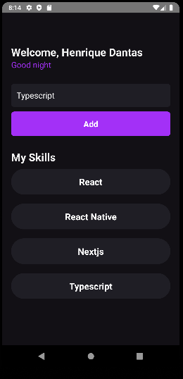

<h1 align="center">
{ MySkills }
</h1>

 

  

## 🚀 Tecnologias

Esse projeto foi desenvolvido utilizando:

- ReactNative
- TypeScript
- StyleSheet

## 💻 Projeto

Esse projeto foi desenvolvido durante o módulo de introdução ao React Native do bootcamp ignite da Rocktseat. Durante o desenvolvimento foi possível aprender sobre configuração de ambiente, estrutura de pastas no React Native e diversos conceitos importantes.
